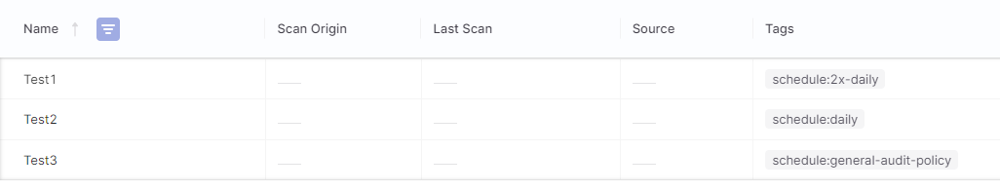
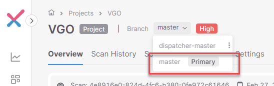

# Checkmarx One Scan Scheduler

The scan scheduler provides a method of automating scan invocation by cadence in Checkmarx One (CxOne).

Some highlights of how it works:

* Runs in a container that builds the scan schedule on startup.
* Works for single- or multi-tenant CxOne.
* Scans can be scheduled per project using one or more of the
following methods:
    * A tag applied to the project with scan details.
    * By the project's group membership.
    * An optional default scan schedule that is applied to projects
    that are not scheduled through one any other schedule criteria.
* Scan schedules are updated periodically to adjust schedules
based on changes in projects that would affect schedule assignments.

## Scheduling Project Scanning

Scheduling scans for a project requires the project has a configured way to clone code from the repository to be scanned.
If the repository is private, a supported set of credentials must also be configured so that the code for scanning can be
cloned. Projects created using the "Code Repository" integration will have the clone credentials automatically managed without the need to configure credentials for each repository.

The following methods can be used to schedule a scan:

* The project is tagged with a `schedule` tag that specifies the schedule scan parameters.
* A project is assigned to one or more groups with a configured group schedule.
* A default schedule is defined and the project is not configured for a scheduled scan via any other method.


### Scheduling via Tags

This is the preferred method of scheduling scans.  Scheduling a project for
scanning requires adding a tag to the project in the form of:

```
schedule:<schedule>:<branch>:<engines>
```

Only one `schedule` tag may be added to a project.  The elements of the
schedule string (e.g. `<schedule>:<branch>:<engines>`) are described below.

The `<branch>` and `<engines>` elements are optional.  Some examples of schedule
strings:

* `<schedule>:<branch>:<engines>` - a schedule string that defines all possible elements.
* `<schedule>` - a schedule string that only defines the scan invocation cadence.  The branch and engines will be determined following the logic described below.
* `<schedule>:<branch>` - a schedule string that defines the scan invocation cadence
as well as the branch to be scanned on each scan invocation.  The engines for
the scan will be determined following the logic described below.
* `<schedule>::<engines>` - a schedule string that defines the scan invocation cadence as well as the engines used for the scan.  The branch has been 
omitted from the schedule string; the branch used for
the scan will be determined following the logic described below.


#### Element: `<schedule>` (required)

The `<schedule>` for scans can be one of the following values:

* `hourly`
* `daily`
* A custom configured [policy name](#policy-definitions).

The image below shows an example of projects configured with different scan
schedules:

* `schedule:2x-daily` corresponds to a [custom scan policy](#policy-definitions)
with the name `POLICY_2X_DAILY`.
* `schedule:daily` corresponds to the built-in `daily` scan schedule.
* `schedule:general-audit-policy` corresponds to a 
[custom scan policy](#policy-definitions) with the name
`POLICY_GENERAL_AUDIT_POLICY`.




#### Element: `<branch>` (optional)

The name of the branch to schedule.  The branch to scan is selected by the
following order of precedence:

1. The branch defined in the tag.
2. The branch selected as the `Primary Branch` in the project configuration.
3. The default branch as defined in the SCM when the project was imported with a code repository integration.

If the branch to scan can't be determined, the scan will not be scheduled.

Selection of the primary branch via the project configuration is shown in the image below:




#### Element: `<engines>` (optional)

The value for `<engines>` can be one of the following:

* `all` to scan with all engines.
* Empty which follows the logic described below.
* A single engine name, which is currently one of the following:
    * `sast`
    * `sca`
    * `kics`
    * `apisec`
* A comma-separated list of two or more of the single engine names.

Duplicated or invalid engine names are ignored.  

The engines for the scan are chosen in the following precedence order:

1. Engines defined explicitly in the tag override all other engine selections.
2. For a project created with a code repository integration, the engines selected in the "Code Repository"
project settings.
3. The engines that were used in the last scan.
4. If the engines for the scan can't be determined, `all` engines are selected.

### Scheduling with a Default Schedule

A default schedule can be applied to projects that are not [scheduled with a tag](#scheduling-via-tags)
or [scheduled with a group](#scheduling-via-assigned-groups).  This method is not advised
unless there are very few projects to schedule for scanning.  If a large number of projects are scheduled to scan
by default, it may cause other scans to take longer as they wait for an available scan engine.

A default schedule  is defined using the `DEFAULT_SCHEDULE` [configuration environment variable](#environment-variables).  Setting it to a schedule policy name 
will cause all projects that have no deterministic schedule to assume the default schedule.

### Scheduling via Assigned Groups

Using environment variables, `<schedule>` values can be assigned to
projects by matching the project's group assignment.  See [Environment Variables](#environment-variables) for information about the group 
scheduling environment variables.

Projects can be assigned to zero or more groups.  If a project is not
assigned to a group, a schedule will only be executed if the project
has a `schedule` tag or a default schedule has been defined. Group schedules 
only execute using the project's configured primary branch; if a
project does not have a primary branch configured, the scan is not scheduled.

Group schedules always execute with all available engine types.


### Schedule Execution Logic

The execution environment is intended to be ephemeral.  A shutdown
and restart will cause the system to re-initialize all schedules by
crawling the projects and assigning schedules based on all methods used
to determine a project's scan schedule.

A project can have more than one scheduled time if it has a `schedule` tag
and/or has a schedule assigned based on membership in one or more groups.
The project's `schedule` tag will always take precedence over any
group schedule assignments.  If a project is assigned to more 
than one group matching a group schedule configuration, it will be scheduled with all group schedules.

At the scheduled time of a scan, the scan will execute unless another
scheduled scan is executing for that project.  This will prevent overlapping schedules
starting multiple scans or long-running scans from being started before
the previously scheduled scan is completed.

Scans executed by the Scan Scheduler are tagged with `scheduled:<crontab string>` when scan tagging on scan invoke is possible.  Scans invoked for projects
created with a Code Repository integration can't be tagged until the scan is complete.
Since the scheduler keeps no state and does not monitor scan executions, scans for projects
created by a Code Repository integration will not be tagged.

If auditing scans from the list of all scans, filtering for scheduled scans
can be accomplished using the `Initiator` column.  The initiator will use the name of 
the Checkmarx One OAuth client used by the scanner to interact with the Checkmarx One API.

## Scan Scheduler Configuration

The Scan Scheduler runs as a container.  At startup, it crawls the tenant's projects and creates the scan schedule.  It then 
checks periodically for any schedule changes and updates 
the scan schedules accordingly.

### Add Optional Trusted CA Certificates

While the Checkmarx One system uses TLS certificates signed by a public CA, it is possible that corporate
proxies use certificates signed by a private CA.  If so, it is possible to import custom CA certificates
when the scheduler starts.

The custom certificates must meet the following criteria:

* Must be in the PEM format.
* Must be in a file ending with the extension `.crt`.
* Only one certificate is in the file.
* Must be mapped to the container path `/usr/local/share/ca-certificates`.

As an example, if using Docker, it is possible to map a local file to a file in the container with this
mapping option added to the container execution command line:

`-v $(pwd)/custom-ca.pem:/usr/local/share/ca-certificates/custom-ca.crt`


### Required Secrets

Docker secrets are used to securely store secrets needed during runtime.
The secrets are mounted in `/run/secrets/<secret-name>`.

The secrets required are:

* `cxone_tenant` - The name of the Checkmarx One tenant.
* `cxone_oauth_client_id` - The Checkmarx One OAuth client identifier.
* `cxone_oauth_client_secret` - The Checkmarx One OAuth client secret.

### OAuth Client

OAuth Clients can be created through Checkmarx One Identity and Access Management.  An OAuth client
should be created that is used only by the Scan Scheduler.

The built-in composite role `ast-scanner` can be assigned to the OAuth client and will work
for scenarios where schedules are determined solely by project tags.

If using the group scheduling configuration, an additional IAM Role `manage-groups` must
also be assigned to the OAuth client so that the Scan Scheduler can retrieve group names for matching
the configured group schedule assignments.  If not using group schedule assignments, the
OAuth client does not require this role.

A custom role with limited capabilities may be configured if desired.  The `ast-scanner`
role will allow the scan scheduler to see all projects, create
scheduled scan for all projects, and execute scans for all projects. 
This level of access may not be appropriate for all organizations.  

To limit the Scan Scheduler's project visibility via group membership
, the following minimum permissions can be assigned to the OAuth Client 
or as a custom composite role:

|Role Type|Name|
|-|-|
|IAM|`manage-groups` (optional)|
|IAM|`user`|
|CxOne|`create-scan-if-in-group`|
|CxOne|`view-scans-if-in-group`|
|CxOne|`view-projects-if-in-group`|
|CxOne|`view-project-params-if-in-group`|

If the role permissions change for the OAuth client, restarting the Scan Scheduler is required.

### Environment Variables

The following runtime environment variables are required to configure the system.  

|Variable|Default|Description|
|-|-|-|
|`CXONE_REGION`|N/A| Required for use with multi-tenant Checkmarx One tenants.  The endpoint region used by your Checkmarx One tenant.  This can be one of the following values: `US`, `US2`, `EU`, `EU2`, `DEU`, `ANZ`, `India`, `Singapore`, or `UAE`. If this is not supplied, the `SINGLE_TENANT_` variables must be defined.|
|`SINGLE_TENANT_AUTH`|N/A|The name of the single-tenant IAM endpoint host. (e.g. `myhost.cxone.cloud`)|
|`SINGLE_TENANT_API`|N/A|The name of the single-tenant API endpoint host. (e.g. `myhost.cxone.cloud`)|
|`DEFAULT_SCHEDULE`|N/A|This defines the default schedule policy to apply to projects that do not have `schedule` tags.  If not provided, projects that do not meet scheduling criteria via tags or group schedules will not be scanned with the scheduler. The value of this environment variable must be a valid `<schedule>` policy name. The branch and engine configurations are not defined as part of the default schedule.|
|`GROUP_x`|N/A|`GROUP_` is considered a prefix with the remainder of the environment variable name being a key value.  The key value is used to match `SCHEDULE_x` variables having the same key value. The value for this environment variable is a group path in the form of `/value/value/...` matching a group defined in Checkmarx One. This environment variable can be defined to apply a schedule to projects assigned to the defined group without the need to assign a `schedule` tag to the project.
|`SCHEDULE_x`|N/A|`SCHEDULE_` is considered a prefix with the remainder of the environment variable name being a key value.  The key value is used to match `GROUP_x` environment variables having the same key value.  The value of this environment variable must be a valid `<schedule>` policy name.|
|`LOG_LEVEL`|INFO|The logging level to control how much logging is emitted.  Set to `DEBUG` for more verbose logging output.|
|`SSL_VERIFY`|`True`| Set to `False` to turn off SSL certificate validation.|
|`PROXY`| N/A | Set to the URL for an unauthenticated proxy. All http/s traffic will route through the specified proxy.|
|`UPDATE_DELAY_SECONDS`| 43200 | The number of seconds to delay between checking for updates in the schedule.|
|`POLICY_<name>`|N/A| Define a custom policy with `<name>`.  See [Policy Definitions](#policy-definitions) for a description.  This must be a valid [crontab](https://crontab.guru/) string.|
|`TIMEZONE`| Etc/UTC | The [zoneinfo](https://en.wikipedia.org/wiki/List_of_tz_database_time_zones) string for the timezone.  If the zoneinfo string is invalid or not set, the timezone will default to UTC.|


### Policy Definitions

Policy definitions allow for scheduled times to be named with a custom name.  These are configured
as environment variables named `POLICY_<name>` where `name` will be matched with the schedule name
using the following criteria:

* Matches are case-insensitive.
* Separators such as underscore (`_`) and dashes (`-`) are considered equivalent.

The value assigned to the environment variable is a valid 
[crontab string](https://www.adminschoice.com/crontab-quick-reference). 

#### Examples of Policy Definitions

Policy definition named `mypolicy` that scans at midnight on weekdays.  It can be referenced with the tag `schedule:mypolicy`.
```
POLICY_MYPOLICY=0 0 * * 1-5
```

Policy definition named `general-audit-policy` that scans every 30 minutes on weekdays.  It can be referenced with
the tag `schedule:general-audit-policy` or `schedule:general_audit_policy`.
```
POLICY_GENERAL_AUDIT_POLICY=0,30 * * * 1-5
```

## Execution


### Obtaining the Container Image

The container image tag is `ghcr.io/checkmarx-ts/cxone/scan-scheduler:latest`.  You can reference this image tag
when running the image.  If running Docker locally, for example, you can retrieve the image with this command:

```
docker pull ghcr.io/checkmarx-ts/cxone/scan-scheduler:latest
```

### Executing the Container Image

Execution methods may vary, but you must consider the following for execution:

1. How to define configuration environment variables.
2. How to map secrets to `/run/secrets`

If running locally with Docker, for example, this command would run the scheduler setting the configuration environment variables 
and map `$(pwd)/run/secrets` to `/run/secrets`:


```
docker run -it -v $(pwd)/run/secrets/:/run/secrets --env-file .env ghcr.io/checkmarx-ts/cxone/scan-scheduler:latest
```

#### Execution Options

By default, executing the container will start the scheduler.  The scheduler will run until the container is stopped.

There are two other runtimes that can be specified: `audit` and
`scanner`.

##### Executing `scanner`

The `scanner` is the tool used by `Cron` to execute scans.  It has some self-explanatory command line arguments that can be retrieved with the `-h` option.
Executing `scanner` to see the help, for example, could be done using the following command line if running Docker locally:

```
docker run -it -v $(pwd)/run/secrets/:/run/secrets --env-file .env ghcr.io/checkmarx-ts/cxone/scan-scheduler:latest scanner -h
```

Which would yield an output similar to the following:

```
A program to execute scans in CheckmarxOne as a Scheduler cron job.

options:
  -h, --help            show this help message and exit
  --projectid PROJECTID, -p PROJECTID
                        The CxOne project id found in the tenant.
  --engine ENGINES, -e ENGINES
                        The engines to use for the scan.
  --repo REPO, -r REPO  The code repository URL.
  --branch BRANCH, -b BRANCH
                        The code repository URL.
  --schedule SCHEDULE, -s SCHEDULE
                        The schedule string assigned to the 'scheduled' scan tag.
```

##### Executing `audit`

The `audit` execution will dump a CSV stream showing how the scheduler
would create the schedule for all projects.

If running Docker locally, the following command line could be used
to dump a CSV to a local file:

```
docker run -it -v $(pwd)/run/secrets/:/run/secrets --env-file .env ghcr.io/checkmarx-ts/cxone/scan-scheduler:latest audit > out.csv
```


#### Python Debugger Execution

If you are a developer that wants to modify the code, you can execute
the container so that you can attach a remote debugger instance.  The
following command line is an example of how to execute the scheduler
so that it waits for a remote debugger to attach before starting:

```
docker run --rm -it -p 5678:5678 -v $(pwd)/run/secrets/:/run/secrets --env-file .env scheduler:latest -Xfrozen_modules=off -m debugpy --listen 0.0.0.0:5678 --wait-for-client scheduler.py
```

The same can be done for the `scanner`:

```
docker run --rm -it -p 5678:5678 -v $(pwd)/run/secrets/:/run/secrets --env-file .env scheduler:latest -Xfrozen_modules=off -m debugpy --listen 0.0.0.0:5678 --wait-for-client scanner.py
```

## Other Notes

### Scan Timing

It is possible to use a crontab string to schedule scans at a high repeat rate.
This is generally a bad idea as it will likely cause scans to queue while waiting for
available resources.  This can lead to experiencing longer scan times for
non-scheduled scans.


### Scheduling Controls via Group Membership

It is possible to assign group membership to the OAuth Client.  The the minimum roles
for a [custom composite role](#oauth-client) can be used in conjunction with group
membership for different ways of controlling how scans are scheduled.

By default, any project viewable with the role and group membership assigned to
the OAuth client can be [tagged](#scheduling-via-tags) and the tag will take
precedence over any other schedule assignment logic.

Projects assigned to the same groups as the OAuth Client will be visible
for evaluating scheduling.  The repository URL and primary branch along with
the project id are used to set the scan schedule.  The schedule can be assigned
using the groups where both the OAuth Client and the project are members in
addition to any other group for which the project is a member.  The OAuth Client
does not need to be a member of all the groups where the project is a member
to be able to schedule scans.

An example of how this might work is as follows:

Assume we have the following projects and group memberships:

* Project A: `/production`
* Project B: `/audit`
* Project C: `/production`, `/audit`

In this scenario, assume the OAuth client is a member of `/production`
but **is not** a member of `/audit`.  If the Scan Scheduler were configured
to assign a schedule to group `/audit`, here is the schedule that would
be created from the projects:

* Project A: No scheduled scan since Project A is not a member of `/audit`.
* Project B: No scheduled scan since the OAuth Client is not a member of `/audit` and can't see the project.
* Project C: A scan would be scheduled since:
    1. The project is a member of `/production` and the OAuth Client can see projects in the same group.
    2. The project is a member of `/audit` and there is a group configuration that matches `/audit`.

This method is primarily useful to automate the scheduling of scans for projects as part of
an onboarding process.  While it is possible to schedule scans with individual project tags,
there may be cases where using group membership is a simpler method of assigning
scan schedules.


