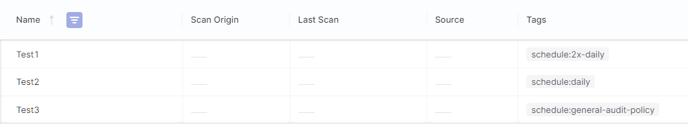
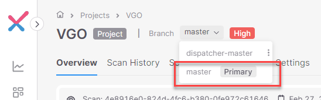

# Checkmarx One Scan Scheduler

The scan scheduler provides a method of automating scan invocation by cadence in Checkmarx One (CxOne).

Some highlights of how it works:

* Runs in a container that builds the scan schedule on startup.
* Works for single- or multi-tenant CxOne.
* Scans can be scheduled per project using one or more of the
following methods:
    * A tag applied to the project with scan details.
    * By the project's group membership.
    * An optional default scan schedule that is applied to projects
    that are not scheduled through one any other schedule criteria.
* Scan schedules are updated periodically to adjust schedules
based on changes in projects that would affect schedule assignments.

## Scheduling Project Scanning

Scheduling scans for a project requires the project has a configured way to clone code from the repository to be scanned.
If the repository is private, a supported set of credentials must also be configured so that the code for scanning can be
cloned. Projects created using the "Code Repository" integration will have the clone credentials automatically managed without the need to configure credentials for each repository.

The following methods can be used to schedule a scan:

* The project is tagged with a `schedule` tag that specifies the schedule scan parameters.
* A project is assigned to one or more groups with a configured group schedule.
* A default schedule is defined and the project is not configured for a scheduled scan via any other method.

### Scheduling via Tags

This is the preferred method of scheduling scans.  Scheduling a project for
scanning requires adding a tag to the project in the form of:

```text
schedule:<schedule>:<branch>:<engines>
```

Only one `schedule` tag may be added to a project.  The elements of the
schedule string (e.g. `<schedule>:<branch>:<engines>`) are described below.

The `<branch>` and `<engines>` elements are optional.  Some examples of schedule
strings:

* `<schedule>:<branch>:<engines>` - a schedule string that defines all possible elements.
* `<schedule>` - a schedule string that only defines the scan invocation cadence.  The branch and engines will be determined following the logic described below.
* `<schedule>:<branch>` - a schedule string that defines the scan invocation cadence
as well as the branch to be scanned on each scan invocation.  The engines for
the scan will be determined following the logic described below.
* `<schedule>::<engines>` - a schedule string that defines the scan invocation cadence as well as the engines used for the scan.  The branch has been 
omitted from the schedule string; the branch used for
the scan will be determined following the logic described below.


#### Element: `<schedule>` (required)

The `<schedule>` for scans can be one of the following values:

* `hourly`
* `daily`
* A custom configured [policy name](#policy-definitions).

The image below shows an example of projects configured with different scan
schedules:

* `schedule:2x-daily` corresponds to a [custom scan policy](#policy-definitions)
with the name `POLICY_2X_DAILY`.
* `schedule:daily` corresponds to the built-in `daily` scan schedule.
* `schedule:general-audit-policy` corresponds to a 
[custom scan policy](#policy-definitions) with the name
`POLICY_GENERAL_AUDIT_POLICY`.




#### Element: `<branch>` (optional)

The name of the branch to schedule.  The branch to scan is selected by the
following order of precedence:

1. The branch defined in the tag.
2. The branch selected as the `Primary Branch` in the project configuration.
3. The default branch as defined in the SCM when the project was imported with a code repository integration.
4. If only one branch is defined as a protected branch when a project was imported with a code repository integration, it is selected as the branch.

If the branch to scan can't be determined, the scan will not be scheduled.

Selection of the primary branch via the project configuration is shown in the image below:



#### Element: `<engines>` (optional)

The value for `<engines>` can be one of the following:

* `all` to scan with all engines.
* Empty which follows the logic described below.
* A single engine name, which is currently one of the following:
    * `sast`
    * `sca`
    * `kics`
    * `apisec`
    * `containers`
    * `2ms`
    * `scorecard` (only available for projects created by importing the repository)
* A comma-separated list of two or more of the single engine names.

Duplicated or invalid engine names are ignored.  

The engines for the scan are chosen in the following precedence order:

1. Engines defined explicitly in the tag override all other engine selections.
2. For a project created with a code repository integration, the engines selected in the "Code Repository"
project settings.
3. Otherwise `all` engines are selected.

### Scheduling with a Default Schedule

A default schedule can be applied to projects that are not [scheduled with a tag](#scheduling-via-tags)
or [scheduled with a group](#scheduling-via-assigned-groups).  This method is not advised
unless there are very few projects to schedule for scanning.  If a large number of projects are scheduled to scan
by default, it may cause other scans to take longer as they wait for an available scan engine. If using this option, it is highly recommended that `FETCH_THROTTLE` is 
also configured.  This will prevent a large number of scans from claiming all
concurrent running scans and filling the scan queue.

A default schedule  is defined using the `DEFAULT_SCHEDULE` [configuration environment variable](#environment-variables).  Setting it to a schedule policy name 
will cause all projects that have no deterministic schedule to assume the default schedule.

### Scheduling via Assigned Groups

Using environment variables, `<schedule>` values can be assigned to
projects by matching the project's group assignment.  See [Environment Variables](#environment-variables) for information about the group 
scheduling environment variables.

Projects can be assigned to zero or more groups.  If a project is not
assigned to a group, a schedule will only be executed if the project
has a `schedule` tag or a default schedule has been defined. Group schedules
only execute using the project's configured primary branch; if a
project does not have a primary branch configured, the scan is not scheduled.

Group schedules always execute with all available engine types.

### Schedule Execution Logic

The execution environment is intended to be ephemeral.  A shutdown
and restart will cause the system to re-initialize all schedules by
crawling the projects and assigning schedules based on all methods used
to determine a project's scan schedule.

A project can have more than one scheduled time if it has a `schedule` tag
and/or has a schedule assigned based on membership in one or more groups.
The project's `schedule` tag will always take precedence over any
group schedule assignments.  If a project is assigned to more 
than one group matching a group schedule configuration, it will be scheduled with all group schedules.

At the scheduled time of a scan, the scan will execute unless another
scheduled scan is executing for that project.  This will prevent overlapping schedules
starting multiple scans or long-running scans from being started before
the previously scheduled scan is completed.

Scans executed by the Scan Scheduler are tagged with `scheduled:<crontab string>` when scan tagging on scan invoke is possible.  Scans invoked for projects
created with a Code Repository integration can't be tagged until the scan is complete.
Since the scheduler keeps no state and does not monitor scan executions, scans for projects
created by a Code Repository integration will not be tagged.

If auditing scans from the list of all scans, filtering for scheduled scans
can be accomplished using the `Initiator` column.  The initiator will use the name of
the Checkmarx One OAuth client used by the scanner to interact with the Checkmarx One API.

## Scan Scheduler Configuration

The Scan Scheduler runs as a container.  At startup, it crawls the tenant's projects and creates the scan schedule.  It then
checks periodically for any schedule changes and updates
the scan schedules accordingly.

### Add Optional Trusted CA Certificates

While the Checkmarx One system uses TLS certificates signed by a public CA, it is possible that corporate
proxies use certificates signed by a private CA.  If so, it is possible to import custom CA certificates
when the scheduler starts.

The custom certificates must meet the following criteria:

* Must be in the PEM format.
* Must be in a file ending with the extension `.crt`.
* Only one certificate is in the file.
* Must be mapped to the container path `/usr/local/share/ca-certificates`.

As an example, if using Docker, it is possible to map a local file to a file in the container with this
mapping option added to the container execution command line:

`-v $(pwd)/custom-ca.pem:/usr/local/share/ca-certificates/custom-ca.crt`

### Required Secrets

Docker secrets are used to securely store secrets needed during runtime.
The secrets are mounted in `/run/secrets/<secret-name>`.

The secrets required are:

* `cxone_tenant` - The name of the Checkmarx One tenant.
* `cxone_oauth_client_id` - The Checkmarx One OAuth client identifier.
* `cxone_oauth_client_secret` - The Checkmarx One OAuth client secret.

### OAuth Client

OAuth Clients can be created through Checkmarx One Identity and Access Management.  An OAuth client
should be created that is used only by the Scan Scheduler.

The built-in composite role `ast-scanner` can be assigned to the OAuth client and will work
for scenarios where schedules are determined solely by project tags.

If using the group scheduling configuration, an additional IAM Role `manage-groups` must
also be assigned to the OAuth client so that the Scan Scheduler can retrieve group names for matching
the configured group schedule assignments.  If not using group schedule assignments, the
OAuth client does not require this role.

Group and role assignments can be applied to the OAuth client to limit the actions
the client can perform.  The `ast-scanner` role will typically provide all required
roles needed to perform scanning.  Custom roles can be created to restrict the
actions that can be taken by the OAuth client.  The minimal roles must allow the OAuth
client to:

* Manage Groups (only if using Group Schedules)
* Create scans
* View scans
* View projects
* View project parameters

#### OAuth Client Authorization

The Checkmarx One IAM has "New" and "Old" versions as of 2025.  Tenants created prior to 2025 will be using the "Old" version until the "New" version is explicitly enabled in the tenant.  If you do not have `*-if-in-group` roles available to assign to the OAuth client, you are using the "New" IAM.

With the "New" IAM, OAuth clients must be assigned a resource authorization so that the
client can operate on projects.  It is suggested to set the Scheduler's OAuth
client authorization at the tenant level so that it can operate on all projects. It
is possible to set the authorization at different resource levels but this may
require manual configuration steps to enable scanning.

### Environment Variables

The following runtime environment variables are required to configure the system.  

|Variable|Default|Description|
|-|-|-|
|`CXONE_REGION`|N/A|Required for use with multi-tenant Checkmarx One tenants.  The endpoint region used by your Checkmarx One tenant.  This can be one of the following values: `US`, `US2`, `EU`, `EU2`, `DEU`, `ANZ`, `India`, `Singapore`, or `UAE`. If this is not supplied, the `SINGLE_TENANT_` variables must be defined.|
|`SINGLE_TENANT_AUTH`|N/A|The name of the single-tenant IAM endpoint host. (e.g. `myhost.cxone.cloud`)|
|`SINGLE_TENANT_API`|N/A|The name of the single-tenant API endpoint host. (e.g. `myhost.cxone.cloud`)|
|`DEFAULT_SCHEDULE`|N/A|This defines the default schedule policy to apply to projects that do not have `schedule` tags.  If not provided, projects that do not meet scheduling criteria via tags or group schedules will not be scanned with the scheduler. The value of this environment variable must be a valid `<schedule>` policy name. The branch and engine configurations are not defined as part of the default schedule.|
|`GROUP_x`|N/A|`GROUP_` is considered a prefix with the remainder of the environment variable name being a key value.  The key value is used to match `SCHEDULE_x` variables having the same key value. The value for this environment variable is a group path in the form of `/value/value/...` matching a group defined in Checkmarx One. This environment variable can be defined to apply a schedule to projects assigned to the defined group without the need to assign a `schedule` tag to the project.|
|`SCHEDULE_x`|N/A|`SCHEDULE_` is considered a prefix with the remainder of the environment variable name being a key value.  The key value is used to match `GROUP_x` environment variables having the same key value.  The value of this environment variable must be a valid `<schedule>` policy name.|
|`LOG_LEVEL`|INFO|The logging level to control how much logging is emitted.  Set to `DEBUG` for more verbose logging output.|
|`SSL_VERIFY`|`True`|Set to `False` to turn off SSL certificate validation.|
|`PROXY`|N/A|Set to the URL for an unauthenticated proxy. All http/s traffic will route through the specified proxy.|
|`UPDATE_DELAY_SECONDS`|43200| The number of seconds to delay between checking for updates in the schedule.|
|`POLICY_<name>`|N/A|Define a custom policy with `<name>`.  See [Policy Definitions](#policy-definitions) for a description.  This must be a valid [crontab](https://crontab.guru/) string.|
|`TIMEZONE`|Etc/UTC|The [zoneinfo](https://en.wikipedia.org/wiki/List_of_tz_database_time_zones) string for the timezone.  If the zoneinfo string is invalid or not set, the timezone will default to UTC.|
|`THREADS`|2|Set to an integer value > 0 to increase the number of threads used when starting scans.  This also sets the max concurrent SCM clones executed if using `FETCH_THROTTLE`.|
|`FETCH_THROTTLE`|False|Set to `True` to wait for the source code clone to complete before submitting another scan.|
|`FETCH_WAIT_SECONDS`|300| The maximum number of seconds to wait for the source code clone to complete before abandoning the wait.  This allows other scan submission activity to continue in cases where the repository clone takes an excessively long time.|
|`RECENT_SCAN_HOURS`|0|This is used to set a policy of not performing a scheduled scan if a successful scan has been executed with the past hours indicated by this value. It is recommended that this value be less than your schedule cadence (e.g. if you scan every 24 hours, this should be a maximum of 23 hours). The check does not inspect the scan configuration, only that the scan has successfully completed. The value of 0 (default) disables this check.|
|`API_TIMEOUT`|60|Set to the number of seconds to wait for the Checkmarx One API to respond to requests before failure.|
|`API_RETRIES`|3|The number of times communicating with the Checkmarx One API will retry upon failure.|
|`API_RETRY_DELAY`|15|The maximum number of seconds to wait before retrying a failure Checkmarx One API request.|

### Policy Definitions

Policy definitions allow for scheduled times to be named with a custom name.  These are configured
as environment variables named `POLICY_<name>` where `name` will be matched with the schedule name
using the following criteria:

* Matches are case-insensitive.
* Separators such as underscore (`_`) and dashes (`-`) are considered equivalent.

The value assigned to the environment variable is a valid
[crontab string](https://www.adminschoice.com/crontab-quick-reference).

#### Examples of Policy Definitions

Policy definition named `mypolicy` that scans at midnight on weekdays.  It can be referenced with the tag `schedule:mypolicy`.

```text
POLICY_MYPOLICY=0 0 * * 1-5
```

Policy definition named `general-audit-policy` that scans every 30 minutes on weekdays.  It can be referenced with
the tag `schedule:general-audit-policy` or `schedule:general_audit_policy`.

```text
POLICY_GENERAL_AUDIT_POLICY=0,30 * * * 1-5
```

## Execution with Docker

### Obtaining the Container Image

The container image tag is `ghcr.io/checkmarx-ts/cxone/scan-scheduler:latest`.  You can reference this image tag
when running the image.  If running Docker locally, for example, you can retrieve the image with this command:

```bash
docker pull ghcr.io/checkmarx-ts/cxone/scan-scheduler:latest
```

### Executing the Container Image

Execution methods may vary, but you must consider the following for execution:

1. How to define configuration environment variables.
2. How to map secrets to `/run/secrets`

If running locally with Docker, for example, this command would run the scheduler setting the configuration environment variables 
and map `$(pwd)/run/secrets` to `/run/secrets`:

```bash
docker run -it -v $(pwd)/run/secrets/:/run/secrets --env-file .env ghcr.io/checkmarx-ts/cxone/scan-scheduler:latest
```

#### Executing the Schedule Audit

By default, executing the container will start the scheduler.  The scheduler will run until the container is stopped.

It is possible to run the container with the `audit` parameter to produce an auditable
schedule.  The `audit` execution will dump a CSV stream showing how the scheduler
would create the schedule for all projects.

If running Docker locally, the following command line could be used
to dump a CSV to a local file:

```bash
docker run -it -v $(pwd)/run/secrets/:/run/secrets --env-file .env ghcr.io/checkmarx-ts/cxone/scan-scheduler:latest audit > out.csv
```

#### Python Debugger Execution

If you are a developer that wants to modify the code, you can execute
the container so that you can attach a remote debugger instance.  The
following command line is an example of how to execute the scheduler
so that it waits for a remote debugger to attach before starting:

```bash
docker run --rm -it -p 5678:5678 -v $(pwd)/run/secrets/:/run/secrets --env-file .env scheduler:latest -Xfrozen_modules=off -m debugpy --listen 0.0.0.0:5678 --wait-for-client scheduler.py
```

## Execution with Kubernetes

Execution with Kubernetes uses a Helm chart that is available as a `.tgz` file with the release artifacts. The Helm chart will deploy the scheduler
to the cluster in the `checkmarx` namespace.  The Helm chart includes a file named `values.yaml` that has documentation content for supplying
configuration values that will be used to configure the container's runtime environment.  Many of the configurations found in `values.yaml` can
be overridden via the Helm command line or your own local copy of the file.  While it is possible to modify the `values.yaml` file directly before
installing the Helm chart, doing so will make it more difficult to update the deployment with new releases.

After the Helm chart is installed, you must define the generic secret containing the required secret values in the `checkmarx` namespace.
One method is to deploy the generic secret via the `kubectl` command line.  Example:

```bash
kubectl create secret generic --namespace=checkmarx cxone-scan-scheduler-secrets \ 
    --from-literal=cxone_tenant=<tenant name> \
    --from-literal=cxone_oauth_client_id=<oauth client id> \
    --from-literal=cxone_oauth_client_secret=<oauth client secret>
```

To map custom CA certificates to the container, provide the name of a ConfigMap
for the `cxone.deployment.ca_certs_configmap_name` configuration parameter that holds the names of files containing custom CA
certificates.  In the following example, the ConfigMap named "cxone-scheduler-custom-cas" is created
with the contents of the file `custom_ca.crt`:

```bash
kubectl create configmap --namespace=checkmarx cxone-scheduler-custom-cas --from-file=custom_ca.crt
```

If the value of `cxone.deployment.ca_certs_configmap_name` is not provided, no custom CA certificates
will be mapped to the container.

A minimal install of the latest release with Helm is shown in the example below.  After installing
the Helm chart, the generic secret and ConfigMap need to be manually created in the `checkmarx` namespace for
the scheduler to start.

```bash
helm install scheduler https://github.com/checkmarx-ts/cxone-scan-scheduler/releases/latest/cxone-scan-scheduler_helm.tgz \
    --set cxone.deployment.secrets_name=cxone-scan-scheduler-secrets \
    --set cxone.connection.multitenant.region=US \
    --set cxone.policies.debug="* * * * *"
```

## Other Notes

### Scan Timing

It is possible to use a crontab string to schedule scans at a high repeat rate.
This is generally a bad idea as it will likely cause scans to queue while waiting for
available resources.  This can lead to experiencing longer scan times for
non-scheduled scans.

### Large Project Counts and Fetch Throttling

When using the scheduler with a large number of projects on the same schedule, the scheduled scans may
put an extreme load on your SCM.  This happens when the scheduler submits scan requests rapidly to Checkmarx One
resulting in many concurrent clone operations to fetch the source to scan.

The configuration `THREADS` controls the number of concurrent scan submissions to Checkmarx One but the rate
of submission will likely be faster than clone operations can complete.  A low thread count will only cause
the count of concurrent clone operations to grow slowly over time.  Eventually the number of concurrent clone
operations will grow higher as the SCM is under load.

Setting the `FETCH_THROTTLE` environment variable to `True` will monitor the source fetch workflow of
a submitted scan.  The monitoring logic will attempt to detect when the source fetch phase of the scan
is completed before allowing another concurrent scan submission.  The logic will check the source fetch workflow
for `FETCH_WAIT_SECONDS` number of seconds before aborting the wait.  This prevents
very large projects from stopping all concurrent scheduled scan submission.

The use of the fetch throttling feature is recommended only for those Checkmarx One tenants that have licensed
100 or more concurrent scans.  Source fetching executes only when scans enter the "running" state; for 100
concurrent scans or less, the amount of time between source fetch operations is likely enough to avoid
overloading the SCM with concurrent clone operations.  Using a low thread count (such as the default 2) should also
help to avoid overloading the SCM by slowly adding the scheduled scans.  With a low number of licensed concurrent scans,
scans in the "queued" state will cause the throttling to wait for the scan to enter the running state before it can
detect when source fetching is complete.

When using the fetch throttling feature, it is recommended that the number of concurrent threads be no less than 10
and no more than the number of licensed concurrent scans.  A thread count that is too low and/or a licensed concurrent
scan count that is too low can cause the scan submissions to take longer than the schedule idle period. If the throttling
does not allow all scan submissions to complete before the next scheduled scan time, it is possible that some projects will
never see scans due to the random nature of how the OS allows threads to become active.

If the fetch throttling is causing all scheduled scans to not get submitted before the next schedule triggers, there
are a few options to try:

* Use the `RECENT_SCAN_HOURS` feature to skip scans for projects that have at least one scan in the defined hours previous to the scheduled scan.
* Increase the number of concurrent scan threads so that more source fetch operations operate in parallel.
* Use multiple schedules to spread the scan activity to multiple schedule windows.
* Increase the licensed number of concurrent scans for your tenant.

If throttling of scheduled scans does not allow a scan throughput higher than the incoming rate of scan requests, this may be
a sign that your SCM may need to be scaled to increase concurrent clone capacity.

### Scheduling Controls via Group Membership

It is possible to assign group membership to the OAuth Client.  The the minimum roles
for a [custom composite role](#oauth-client) can be used in conjunction with group
membership for different ways of controlling how scans are scheduled.

By default, any project viewable with the role and group membership assigned to
the OAuth client can be [tagged](#scheduling-via-tags) and the tag will take
precedence over any other schedule assignment logic.

Projects assigned to the same groups as the OAuth Client will be visible
for evaluating scheduling.  The repository URL and primary branch along with
the project id are used to set the scan schedule.  The schedule can be assigned
using the groups where both the OAuth Client and the project are members in
addition to any other group for which the project is a member.  The OAuth Client
does not need to be a member of all the groups where the project is a member
to be able to schedule scans.

An example of how this might work is as follows:

Assume we have the following projects and group memberships:

* Project A: `/production`
* Project B: `/audit`
* Project C: `/production`, `/audit`

In this scenario, assume the OAuth client is a member of `/production`
but **is not** a member of `/audit`.  If the Scan Scheduler were configured
to assign a schedule to group `/audit`, here is the schedule that would
be created from the projects:

* Project A: No scheduled scan since Project A is not a member of `/audit`.
* Project B: No scheduled scan since the OAuth Client is not a member of `/audit` and can't see the project.
* Project C: A scan would be scheduled since:
    1. The project is a member of `/production` and the OAuth Client can see projects in the same group.
    2. The project is a member of `/audit` and there is a group configuration that matches `/audit`.

This method is primarily useful to automate the scheduling of scans for projects as part of
an onboarding process.  While it is possible to schedule scans with individual project tags,
there may be cases where using group membership is a simpler method of assigning
scan schedules.
